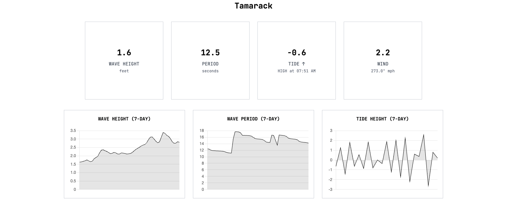

# DuckDive

A real-time surf forecasting application that provides accurate, localized surf conditions using free NOAA data and advanced wave modeling.



## ✨ Features

- **Real-time Surf Conditions**: Wave height, tide, wind speed, and water temperature
- **7-Day Forecasts**: Interactive charts for wave height, period, and tide predictions  
- **Tide Intelligence**: Shows tide direction (↑/↓) and next high/low tide times
- **Mobile Responsive**: Clean, retro-inspired design that works on all devices
- **Multiple Surf Spots**: Easy spot navigation with custom dropdown
- **Auto-refresh**: Updates every hour for current conditions
- **API Access**: RESTful endpoints for programmatic data access

## 🌊 How It Works

DuckDive fetches raw oceanographic data from NOAA and processes it into surf-specific metrics:

1. **Wave Height**: Uses GFS wave models and bathymetry data to calculate breaking wave heights
2. **Tides**: Retrieves high/low tide predictions from NOAA tide stations
3. **Wind**: Gets real-time wind speed and direction from weather models  
4. **Water Temperature**: Pulls data from nearby NOAA buoys
5. **Wave Period**: Extracts wave period data for wave quality assessment

All data is stored in Supabase and served via a FastAPI web application.

## 🚀 Quick Start

### Prerequisites

- Python 3.11+
- Supabase account (for data storage)
- Git

### Installation

1. **Clone the repository**
   ```bash
   git clone https://github.com/abenstirling/DuckDive.git
   cd DuckDive
   ```

2. **Set up environment variables**
   ```bash
   cp .env.example .env
   # Edit .env with your Supabase credentials
   ```

3. **Install dependencies**
   ```bash
   chmod +x build.sh
   ./build.sh
   ```

4. **Start the server**
   ```bash
   python main.py
   ```

5. **Visit the application**
   Open http://localhost:8000 in your browser

## 🔧 Configuration

### Environment Variables

Create a `.env` file with:

```env
SUPABASE_URL=your_supabase_project_url
SUPABASE_ANON_KEY=your_supabase_anon_key
```

### Adding Surf Spots

Edit `surf_spots.csv` to add new locations:

```csv
name,closest_station,location_n,closest_tide,location_w,altitude,depth,angle,slope,wave_model,stream_link
'Your Spot',46224,33.146,9410230,117.346,30.0,25.0,225.0,0.02,'us_west_coast_gfs_wave_model',null
```

**Parameters:**
- `closest_station`: NOAA buoy station ID for wave/wind data
- `location_n/w`: Latitude/longitude coordinates  
- `closest_tide`: NOAA tide station ID
- `depth`: Water depth in feet (for wave breaking calculations)
- `angle`: Shore angle in degrees (affects wave direction)
- `slope`: Bottom slope (affects wave breaking characteristics)
- `stream_link`: Optional live webcam URL

## 📁 Project Structure

```
DuckDive/
├── main.py                           # FastAPI web application
├── surf_report_update_spot.py        # Main data orchestration
├── surf_report_wave_height.py        # Wave height forecasting
├── surf_report_tides.py              # Tide data fetching
├── surf_report_winds.py              # Wind conditions
├── surf_report_water_temperature.py  # Water temperature
├── surf_report_period.py             # Wave period data
├── static/
│   └── index.html                    # Frontend template
├── surf_spots.csv                    # Surf spot configurations
├── requirements.txt                  # Python dependencies
├── build.sh                          # Build script
└── surfpy/                          # NOAA data library
```

## 🔌 API Endpoints

### Get Surf Report
```http
GET /api/get_report?spot=tamarack
```

### Update Spot Data  
```http
GET /api/update_spot?spot=tamarack
```

### Submit New Spot Request
```http
POST /api/new_spot_request
Content-Type: application/json

{
  "email": "user@example.com",
  "spot_name": "Mavericks"
}
```

## 🛠 Development

### Local Development

1. **Install in development mode**
   ```bash
   pip install -r requirements.txt
   cd surfpy && pip install -e . && cd ..
   ```

2. **Run with auto-reload**
   ```bash
   uvicorn main:app --reload --host 0.0.0.0 --port 8000
   ```

### Adding New Data Sources

1. Create a new module following the pattern `surf_report_[data_type].py`
2. Implement a function that returns structured data
3. Import and integrate in `surf_report_update_spot.py`
4. Update the database schema if needed

### Testing Data Updates

```bash
# Update a specific surf spot
curl "http://localhost:8000/api/update_spot?spot=tamarack"

# View the updated data
curl "http://localhost:8000/api/get_report?spot=tamarack"
```

## 🏗 Deployment

### Render.com (Recommended)

1. Connect your GitHub repository to Render
2. Set environment variables in Render dashboard
3. Use the provided `build.sh` script
4. Set start command: `python main.py`

### Manual Deployment

1. **Set up the server**
   ```bash
   git clone https://github.com/abenstirling/DuckDive.git
   cd DuckDive
   ./build.sh
   ```

2. **Configure systemd service** (optional)
   ```bash
   sudo cp duckdive.service /etc/systemd/system/
   sudo systemctl enable duckdive
   sudo systemctl start duckdive
   ```

3. **Set up reverse proxy** (nginx recommended)

## 📊 Database Schema

The application uses Supabase with the following main table:

**`surf_reports`**
- `spot_name`: Surf spot identifier
- `timestamp`: Report generation time
- `current_wave_height`: Current wave height (ft)
- `current_tide_height`: Current tide height (ft) 
- `current_period`: Current wave period (sec)
- `water_temp_f`: Water temperature (°F)
- `wind_speed_mph`: Wind speed (mph)
- `wind_direction_deg`: Wind direction (degrees)
- `wave_forecast_168h`: 7-day wave height forecast (JSON)
- `tide_forecast_7d`: 7-day tide forecast (JSON)
- `period_forecast_168h`: 7-day period forecast (JSON)

## 🤝 Contributing

1. Fork the repository
2. Create a feature branch (`git checkout -b feature/amazing-feature`)
3. Commit your changes (`git commit -m 'Add amazing feature'`)
4. Push to the branch (`git push origin feature/amazing-feature`)
5. Open a Pull Request

### Contribution Guidelines

- Follow existing code style and patterns
- Add tests for new features
- Update documentation for API changes
- Test with multiple surf spots before submitting

## 📄 License

This project is open source and available under the [MIT License](LICENSE).

## 🙏 Acknowledgments

- **NOAA**: For providing free, high-quality oceanographic data
- **surfpy**: The core library powering our wave calculations
- **Supabase**: For reliable database hosting
- **FastAPI**: For the excellent web framework

## 📈 Data Sources

- **Wave Data**: NOAA GFS Wave Model (Global Forecast System)
- **Tide Data**: NOAA Harmonic Tide Predictions
- **Wind Data**: NOAA GFS Weather Model  
- **Water Temperature**: NOAA Buoy Stations (NDBC)
- **Bathymetry**: Built into surf spot configurations

## 🐛 Troubleshooting

### Common Issues

**"No data available"**
- Check Supabase connection
- Verify surf spot exists in `surf_spots.csv`
- Run data update: `/api/update_spot?spot=yourspot`

**Charts not loading**
- Ensure data update completed successfully
- Check browser console for JavaScript errors
- Verify JSON data in database

**Slow loading**
- NOAA APIs can be slow during peak times
- Consider caching strategies for production

### Getting Help

- Check existing [Issues](https://github.com/abenstirling/DuckDive/issues)
- Create a new issue with detailed error information
- Include your `surf_spots.csv` configuration if spot-specific

---

**Made with ❤️ for the surf community**

*DuckDive provides free, accurate surf forecasts using open data sources. No API keys, no subscriptions, just pure oceanographic data.*